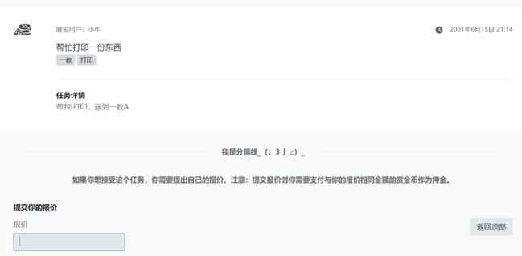

# Task_Platform_University
A newer version of the university  [task platform](https://github.com/hx-w/SCU-reward-platform).

This Repo is a newer version of the task platform. 
The basic function: The user can publish and receive the tasks.

Our work: Define subtasks from the original task.

Some screenshots:

